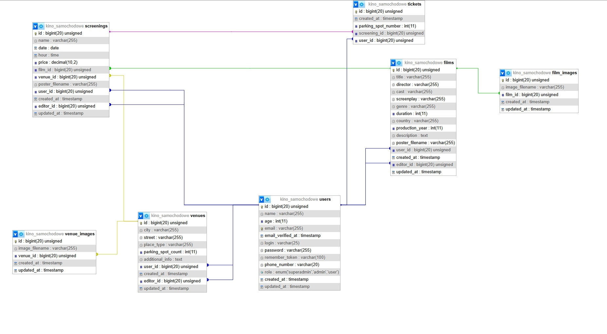

# 🎬 Kino Samochodowe – Django

Aplikacja webowa umożliwiająca zarządzanie kinem samochodowym.

Projekt pozwala użytkownikom przeglądać repertuar, rezerwować miejsca parkingowe, kupować bilety oraz zarządzać swoim kontem. Administrator posiada panel administracyjny umożliwiający zarządzanie filmami, seansami, użytkownikami oraz rezerwacjami.

Projekt został wykonany w języku **Python** z wykorzystaniem frameworka **Django** jako projekt rozwijający umiejętności tworzenia aplikacji backendowych oraz projektowania relacyjnych baz danych.

---

## Strona główna


## Opis filmu


## Lista seansów


## Logowanie


## Rejestracja


## Rozkład miejsc


## Bilet


---

# ✨ Funkcjonalności

- Rejestracja użytkowników
- Logowanie i autoryzacja
- Role użytkowników
- Zarządzanie filmami
- Zarządzanie repertuarem
- Zarządzanie seansami
- Rezerwacja miejsc
- Zakup biletów
- Generowanie kodów QR
- Historia zakupów
- Panel administratora
- Zarządzanie użytkownikami

---

# 🛠 Technologie

- Python
- Django
- MySQL
- HTML
- CSS
- JavaScript
- Git

---

# 🗄 Baza danych

Projekt wykorzystuje relacyjną bazę danych **MySQL**.

Najważniejsze encje:

- Users
- Movies
- Screenings
- Tickets
- Reservations
- ParkingPlaces



W repozytorium znajdują się dwa pliki `.sql` umożliwiające odtworzenie bazy danych:

- `database_empty.sql` – baza zawierająca strukturę oraz podstawowe konta użytkowników
- `database_demo.sql` – baza zawierająca strukturę oraz przykładowe dane demonstracyjne

---

# 🚀 Instalacja

## 1. Klonowanie repozytorium

```bash
git clone https://github.com/MatemXVI/kino-samochodowe-django.git
```

## 2. Przejście do katalogu projektu

```bash
cd kino-samochodowe-django
```

## 3. Utworzenie środowiska wirtualnego

### Windows

```bash
python -m venv venv
venv\Scripts\activate
```

### Linux

```bash
python -m venv venv
source venv/bin/activate
```

## 4. Instalacja wymaganych bibliotek

```bash
pip install -r requirements.txt
```

## 5. Przygotowanie bazy danych

Utwórz bazę danych **MySQL**, a następnie zaimportuj do niej jeden z dołączonych plików `.sql`:

- `database_empty.sql` – podstawowa wersja bazy
- `database_demo.sql` – wersja zawierająca przykładowe dane demonstracyjne

Dane dostępowe do utworzonej bazy należy następnie skonfigurować w pliku `settings.py` projektu Django.

## 6. Migracje

W razie potrzeby wykonaj migracje:

```bash
python manage.py migrate
```

## 7. Uruchomienie aplikacji

```bash
python manage.py runserver
```

Aplikacja będzie dostępna pod adresem:

```text
http://127.0.0.1:8000
```

---

# 👤 Konto testowe

W dostarczonej bazie danych dostępne jest konto administratora:

**E-mail:** `root@root.com`  
**Hasło:** `root`  
**Rola:** `superadmin`

Możliwe jest również utworzenie własnego konta użytkownika z rolą `user`.

---
# 📂 Struktura projektu

```
kino/

movies/

users/

tickets/

templates/

static/

media/

manage.py
```

---

# 📖 Czego nauczyłem się podczas projektu

Projekt pozwolił mi zdobyć praktyczne doświadczenie w zakresie:

- tworzenia aplikacji w Django
- Django ORM
- projektowania relacyjnych baz danych
- migracji bazy danych
- autoryzacji użytkowników
- obsługi formularzy
- architektury MVC (MVT w Django)
- organizacji większego projektu backendowego

---

# 🔮 Możliwe kierunki rozwoju

- płatności online
- wysyłka biletów e-mailem
- generowanie PDF z biletem
- panel statystyk
- integracja REST API
- Docker
- testy automatyczne

---

# 👨‍💻 Autor

**Mateusz Milczarek**

[GitHub – MatemXVI](https://github.com/MatemXVI)
