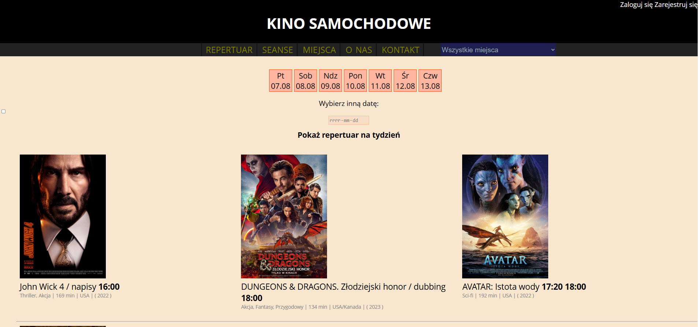
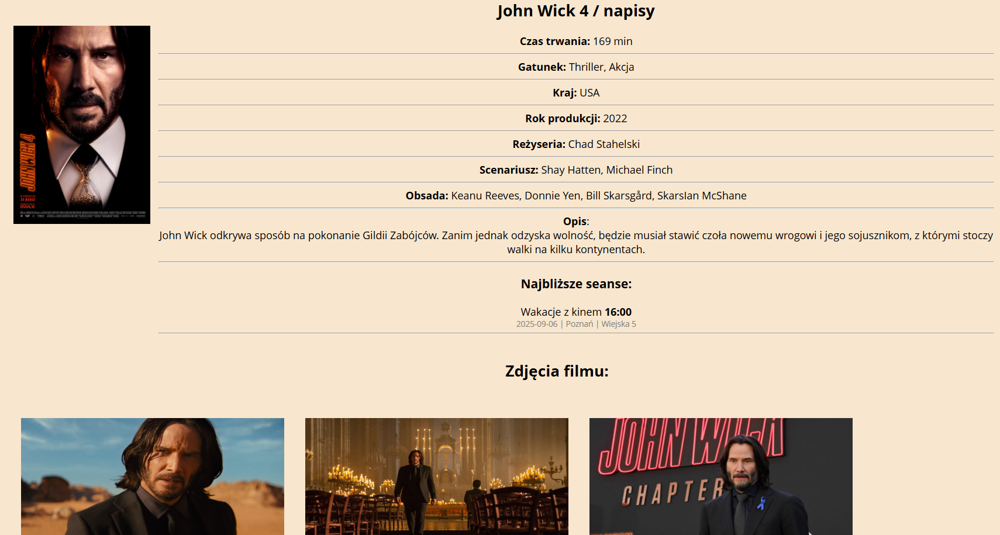
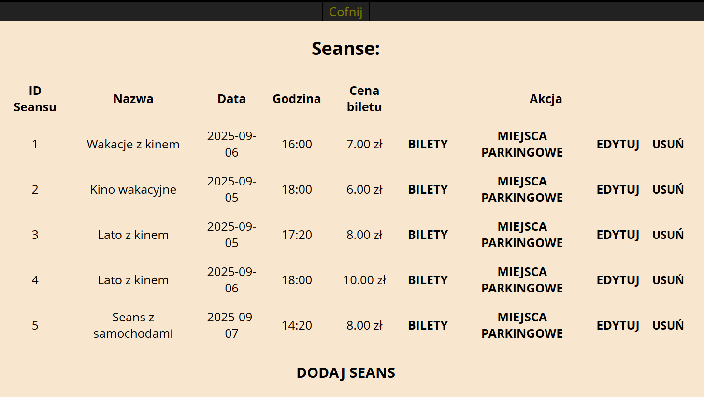
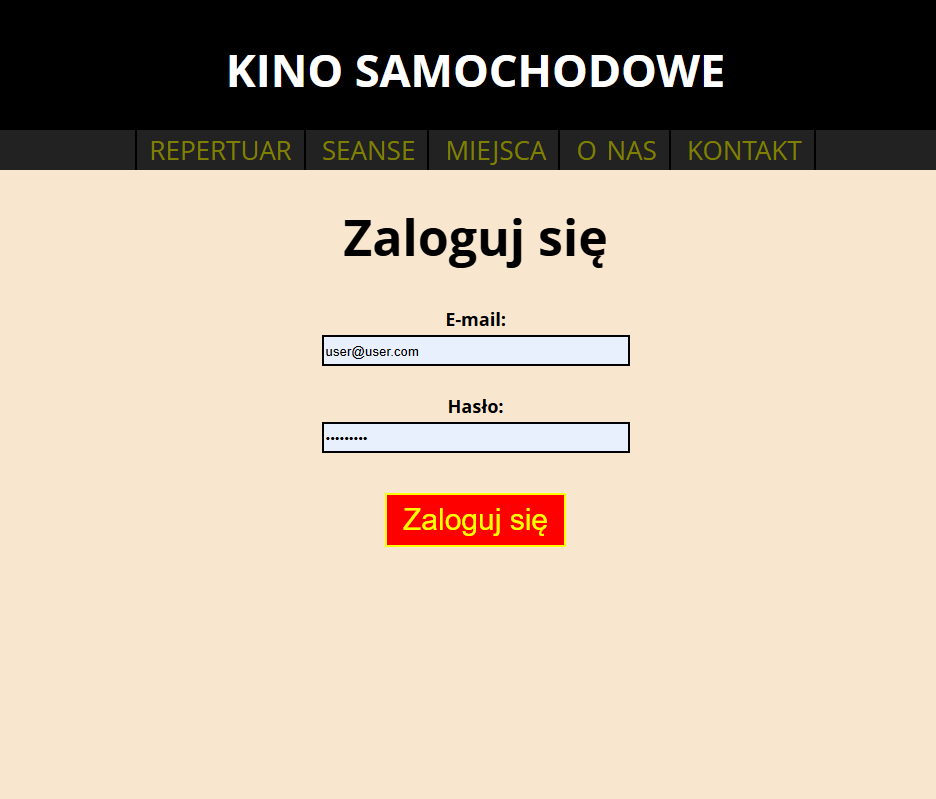
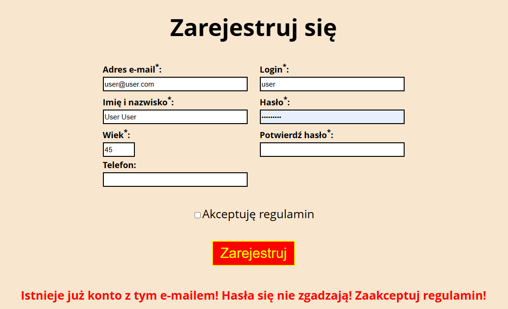
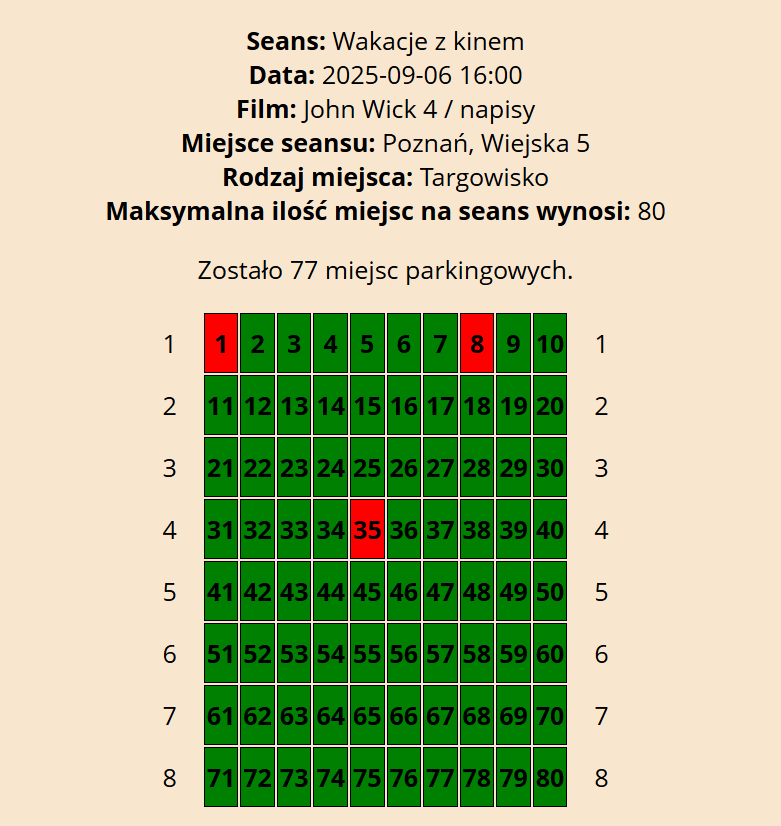
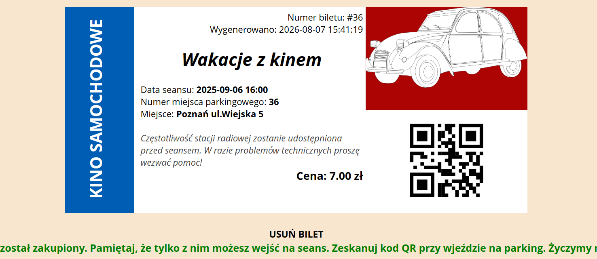

# 🎬 Kino Samochodowe – Django

Aplikacja webowa umożliwiająca zarządzanie kinem samochodowym.

Projekt pozwala użytkownikom przeglądać repertuar, rezerwować miejsca parkingowe, kupować bilety oraz zarządzać swoim kontem. Administrator posiada panel administracyjny umożliwiający zarządzanie filmami, seansami, użytkownikami oraz rezerwacjami.

Projekt został wykonany w języku **Python** z wykorzystaniem frameworka **Django** jako projekt rozwijający umiejętności tworzenia aplikacji backendowych oraz projektowania relacyjnych baz danych.

---

# 📸 Zrzuty ekranu

## Strona główna



## Opis filmu



## Lista senasów



## Logowanie



## Rejestracja



## Rozkład miejsc



## Bilet



---

# ✨ Funkcjonalności

- Rejestracja użytkowników
- Logowanie i autoryzacja
- Role użytkowników
- Zarządzanie filmami
- Zarządzanie repertuarem
- Zarządzanie seansami
- Rezerwacja miejsc
- Zakup biletów
- Generowanie kodów QR
- Historia zakupów
- Panel administratora
- Zarządzanie użytkownikami

---

# 🛠 Technologie

- Python
- Django
- MySQL
- HTML
- CSS
- Bootstrap
- JavaScript
- Git

---

# 🗄 Baza danych

Projekt wykorzystuje relacyjną bazę danych MySQL.

Najważniejsze encje:

- Users
- Movies
- Screenings
- Tickets
- Reservations
- ParkingPlaces

*(tu możesz wkleić diagram ERD)*

---

# 🚀 Instalacja

## 1. Klonowanie repozytorium

```bash
git clone https://github.com/MatemXVI/kino-samochodowe-django.git
```

## 2. Przejście do katalogu

```bash
cd kino-samochodowe-django
```

## 3. Utworzenie środowiska

Windows

```bash
python -m venv venv
```

Aktywacja

```bash
venv\Scripts\activate
```

Linux

```bash
source venv/bin/activate
```

## 4. Instalacja bibliotek

```bash
pip install -r requirements.txt
```

## 5. Konfiguracja bazy danych

W pliku

```
settings.py
```

należy uzupełnić dane połączenia z bazą MySQL.

## 6. Migracje

```bash
python manage.py migrate
```

## 7. Uruchomienie projektu

```bash
python manage.py runserver
```

Aplikacja będzie dostępna pod adresem

```
http://127.0.0.1:8000
```

---

# 👤 Konto testowe

Jeżeli projekt zawiera dane przykładowe.

Administrator

login:

```
admin
```

hasło

```
admin123
```

---

# 📂 Struktura projektu

```
kino/

movies/

users/

tickets/

templates/

static/

media/

manage.py
```

---

# 📖 Czego nauczyłem się podczas projektu

Projekt pozwolił mi zdobyć praktyczne doświadczenie w zakresie:

- tworzenia aplikacji w Django
- Django ORM
- projektowania relacyjnych baz danych
- migracji bazy danych
- autoryzacji użytkowników
- obsługi formularzy
- architektury MVC (MVT w Django)
- pracy z Git
- organizacji większego projektu backendowego

---

# 🔮 Możliwe kierunki rozwoju

- płatności online
- wysyłka biletów e-mailem
- panel statystyk
- integracja REST API
- Docker
- testy automatyczne

---

# 👨‍💻 Autor

Mateusz Milczarek

GitHub

https://github.com/MatemXVI
